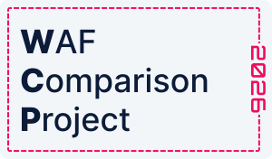

# WAF Comparison Project (WCP)

---

This project provides a comprehensive framework for evaluating the effectiveness of Web Application Firewalls (WAFs)
using real-world legitimate and malicious HTTP request datasets. It supports testing and comparing one or more WAF
solutions, and automatically generates a PDF report that summarizes the results for easy sharing and review.

## Table of Contents

---

* [Overview](#overview)
* [Setup Instructions](#setup-instructions)
* [Methodology](#methodology)
* [Advanced Configuration](#advanced-configuration)
    * [Configure the Upstream Application](#configure-the-upstream-application)
    * [File Structure and Persistence](#file-structure-and-persistence)
    * [Modifying Data Sets](#modifying-data-sets)
    * [Changing Database or Output Paths](#changing-database-or-output-paths)
    * [Customizing the PDF Report](#customizing-the-pdf-report)
* [License](#license)
* [Related Resources](#related-resources)
* [Contact](#contact)

## Overview

---
This WCP contains testing datasets and tools to compare WAF efficacy in the 3 most important
categories:

- **Security Quality** (True Positive Rate) - measures the WAF's ability to correctly identify and block malicious
  requests
  is crucial in today's threat landscape. It must preemptively block zero-day attacks as well as effectively tackle
  known attack techniques utilized by hackers.


- **Detection Quality** (True Negative Rate) - measures the WAF's ability to correctly allow legitimate requests. Any
  hindrance to these valid requests could lead to significant business disruption and an increased workload for
  administrators.


- **Balanced Accuracy** - represents the average of the Security Quality (True Positive Rate) and Detection Quality (
  True
  Negative Rate). It provides a single, unified metric that reflects the WAF’s overall ability to both correctly block
  malicious traffic and correctly allow legitimate traffic.
  Balanced Accuracy formula:
  $$BA =\frac{\text{TPR} + \text{TNR}}{2}$$

This project aims to measure the efficacy of each WAF against a variety of legitimate and malicious HTTP requests,
taken
from real-world scenarios.

The project is described in detail in
this [blog](https://www.openappsec.io/post/best-waf-solutions-in-2026-real-world-comparison).

## Setup Instructions

---

### Follow the steps below to set up and run the tool:

1. Pull the WCP image from Docker Hub:

    ```shell
    docker pull ghcr.io/openappsec/waf-comparison-project:latest
    ```

2. (Optional) Configure the upstream application

   If you need to set up an upstream application before your WAFs, refer
   to [Configure the upstream application](#configure-the-upstream-application).


3. Run the image

    ```shell
    docker run --rm --name=waf-comparison-project \
     -v ${PWD}/results:/app/results ghcr.io/openappsec/waf-comparison-project:latest \
     --waf-name="<WAF_NAME>" --waf-url="<WAF_URL>"
    ```

   You can add as many `--waf-name` and `--waf-url` pairs as you want, in order to test multiple WAFs in a single run.
   <br/>
   <br/>
   Example:
    ```shell
    docker run --rm --name=waf-comparison-project 
     -v ${PWD}/results:/app/results ghcr.io/openappsec/waf-comparison-project:latest \
      --waf-name="First WAF" --waf-url="http://first-waf.com" \
      --waf-name="Second WAF" --waf-url="http://second=waf.com"
    ```

   You may also use the optional `--max-workers` flag to control the number of concurrent worker threads (default: 4).
   <br/>
   <br/>
   Example:
    ```shell
    docker run --rm --name=waf-comparison-project \
    -v ${PWD}/results:/app/results ghcr.io/openappsec/waf-comparison-project:latest \
    --waf-name="First WAF" --waf-url="http://first-waf.com" \
    --max-workers=8
    ```

   You may also use the optional `--fast` flag to enable fast mode, which processes only ~15% of requests (sampled with
   a constant seed for reproducibility). This is useful for quick testing and development.
   <br/>
   <br/>
   Example:
    ```shell
    docker run --rm --name=waf-comparison-project \
    -v ${PWD}/results:/app/results ghcr.io/openappsec/waf-comparison-project:latest \
    --waf-name="First WAF" --waf-url="http://first-waf.com" \
    --fast
    ```

After the run is complete, the analysis PDF file result will be saved as `results/waf-comparison-report.pdf` in your
current directory.

**Note:**

- If you run the tool again, it will reuse the existing results database and WAFs config
  files, so any changes to the `--waf-name`, `--waf-url`, `--max-workers` and `--fast` flags will have **no effect**
  unless you use
  `--fresh-run`.
  Please
  notice it will **delete the previous results** and will rerun everything from scratch.
- To apply new WAF configuration, and run the tests for it add the `--fresh-run` flag:
  ```shell
  docker run --rm --name=waf-comparison-project \
    -v ${PWD}/results:/app/results ghcr.io/openappsec/waf-comparison-project:latest \
    --fresh-run \
    --waf-name="<WAF_NAME>" --waf-url="<WAF_URL>"
  ```

### Monitoring Logs

You can monitor the tool's progress and view logs in two ways:

1. **Using Docker logs (real-time):**

   Follow the logs in real-time while the container is running:
   ```shell
   docker logs waf-comparison-project -f
   ```

   **Note:** If the container has already exited, you won't be able to view the logs using this
   method. In that case, use the log files method below.

2. **Reading log files:**

   You can find all log files in the `results/logs/` directory under your current directory.

## Methodology

---
Each WAF solution is tested against two data sets: legitimate and malicious. We then calculate the scores for each WAF
based on the results from these data sets.

The data sets used for this project are available via the hyperlinks below and will be updated annually.

**Note:** The pre-tested WAFs results are based on the results of analysis done on 20/11/2025, for more information you
can
find the specific configurations in
our [blog](https://www.openappsec.io/post/best-waf-solutions-in-2026-real-world-comparison).

### Legitimate Data Set

The Legitimate Requests Dataset is carefully designed to test WAF behaviors in real-world scenarios. To attain this, it
includes 1,040,242 different HTTP requests from 185 real-web sites in 12 categories. Each dataset was recorded by
browsing
to real-world websites and conducting various operations in the site (for example, sign-up, selecting products and
placing in a cart, etc.) ensuring the presence of 100% legitimate requests.

The Legitimate data set is located and loaded
from [here](https://downloads.openappsec.io/waf-comparison-project/legitimate.zip)

### Malicious Data Set

The Malicious Requests Dataset includes 73,924 malicious payloads from a broad spectrum of commonly experienced attack
vectors:

- SQL Injection-
- Cross-Site Scripting (XSS)
- XML External Entity (XXE)
- Path Traversal
- Command Execution
- Log4Shell
- Shellshock

The malicious payloads were sourced from the WAF Payload Collection GitHub page that was assembled by mgm security
partners GmbH from Germany. This repository serves as a valuable resource, providing payloads specifically created for
testing Web Application Firewall rules.

The Malicious data set is located and loaded
from [here](https://downloads.openappsec.io/waf-comparison-project/malicious.zip).
And also from this [repo](https://github.com/openappsec/mgm-web-attack-payloads).

## Advanced Configuration

---

<details><summary>Configure the upstream application</summary>

### Configure the upstream application

This works both when nginx is an upstream application before third-party WAFs like Cloudflare and when WAFs are
integrated
directly on top of nginx, such as Check Point CloudGuard WAF or F5 App Protect.

a. We start by installing nginx for our machine (e.g Debian based distributions):

```shell
sudo apt update
sudo apt install -y nginx
```

b. Next, we need to replace the default nginx configuration with our custom configuration:

- Edit the default nginx configuration file:
   ```shell
  sudo nano /etc/nginx/sites-available/default
  ```
- Replace its content with the following configuration:
    ```nginx
    server {
        listen 80 default_server;
        listen [::]:80 default_server;
        client_max_body_size 1G;
        server_name _;
     
        location / {
            proxy_set_header Host $host;
            proxy_pass http://localhost:8080;
        }
    }
     
    server {
        listen 8080 default_server;
        client_max_body_size 1G;
        location / {
            add_header Content-Type text/plain;
            return 200 "OK";
        }
    }
    ```

c. Save the file and exit the editor.

d. Restart nginx to apply the new configuration:

```shell
sudo systemctl restart nginx
```

</details>
<details><summary>File Structure and Persistence</summary>

### File Structure and Persistence

- All results, including the PDF report, the results DB and the WAF configuration, are written to the `results`
  directory you mount into the container.
- The main results database is a DuckDB file, and saved as `results/db/waf_comparison.duckdb`.
- The WAF configuration file is saved as `results/db/wafs_config.json`.
- The fetched `Legitimate` and `Malicious` datasets are stored in `results/datasets/`.
- The PDF report is saved as `results/waf-comparison-report.pdf`.

</details>

<details><summary>Modifying Data Sets</summary>

### Modifying Data Sets

- The tool automatically downloads and extracts the latest legitimate and malicious datasets on first run.
- To use custom datasets, replace the `JSON` files in the `results/datasets/Legitimate` and `results/datasets/Malicious`
  directories before running the tool, when you run,
  use the `--fresh-run` flag in order to apply the new datasets.
- Note: make sure your datasets folders match the malicious and legitimate folder names as in `config.py`, and in JSON
  format with requests data.

</details>

<details><summary>Changing Database or Output Paths</summary>

### Changing Database or Output Paths

- You can change the output and database paths by editing the constants in `config.py`:

- Paths:
    - `RESULTS_PATH`: Where all results are stored, including the PDF report, datasets, database and config files.
    - `DB_PATH`: Where the WAFs database and config files are stored.
    - `DATA_SETS_PATH`: Where the datasets are stored.
    - `LOGS_PATH`: Where the logs are stored.
- Constants:
    - `DB_DIALECT`: The database engine to use (default: `duckdb`).
    - `DB_FILE_NAME`: The filename for the database (default: `waf_comparison.duckdb`).
    - `PDF_REPORT_FILE_NAME`: The filename for the PDF report (default:
      `waf-comparison-report.pdf`).
- To switch to a different database, modify the related constants according to the `conn` in `config.py`:
  ```python
  conn = create_engine(f"{DB_DIALECT}:///{DB_PATH / DB_FILE_NAME}")
  ```
  By default, this uses DuckDB, but you can set `DB_DIALECT` and `DB_FILE_NAME` to use other databases (e.g., Postgres,
  MySQL, SQLite, etc.) by providing the appropriate SQLAlchemy connection string and file or database name.
- **Note:** If you switch to a different database engine, some SQL queries in the code may need minor adjustments to
  ensure compatibility.

</details>

<details><summary>Customizing the PDF Report</summary>

### Customizing the PDF Report

To customize the PDF report:

1. Clone this project to your local environment.
2. Adjust the logic in `analyzer.py` and modify files in the `report/` folder as wanted to change report layout, graphs,
   content, or visualizations.
    - The `report/` folder contains the main report generation logic and supporting modules.
    - The `report/graphs/` subfolder includes graph components for generating charts and visualizations (e.g., bar
      chart, scatter plot, scorecard, etc.).
    - The `report/templates/` subfolder contains HTML template, CSS styling, images and font files. used for rendering
      the PDF report.
3. Build a new Docker image with your changes:
   ```shell
   docker build -t waf-comparison-project-custom .
   ```
4. Rerun the tool using your custom image to generate the updated PDF report:
   ```shell
   docker run --rm --name=waf-comparison-project \
     -v ${PWD}/results:/app/results waf-comparison-project-custom \
     --waf-name="<WAF_NAME>" --waf-url="<WAF_URL>"
   ```

**Note:**

- On the first run, the tool creates the `results/` folder and saves all results files there.
- If you want to rerun the report with new WAF configuration or datasets, use the `--fresh-run` flag
  to start from scratch (this will delete previous results and rerun all tests).
- If you only want to change the PDF report visuals on existing results (using a customized Docker
  image like above / [run programmatically](#using-the-tool-programmatically)) you can rerun the
  tool <ins>without</ins>
  `--fresh-run` to reuse the existing results and quickly generate a new PDF report with your customizations.

#### Using the Tool Programmatically

- `runner.py`: Runs the full WAF test flow, sending all requests to the configured WAFs and saving results to the
  database.
- `analyzer.py`: Loads the results from the database, analyzes them, and then generates the comparison PDF report.

</details>

## License

---

The Legitimate Requests Dataset and the Tooling are available under Apache 2.0 license.
The Malicious Requests Dataset is a collection of datasets assembled by MGM with different copyrights, mostly under MIT.

## Related Resources

---

* For an in-depth discussion and analysis of the results, see
  our [WAF Comparison Blog Post](https://www.openappsec.io/post/best-waf-solutions-in-2026-real-world-comparison).

* WAF Payload Collection - [MGM WAF Payload Collection](https://github.com/mgm-sp/WAF-Payload-Collection)

## Contact

For any questions or concerns, please open an issue in this GitHub repository.
